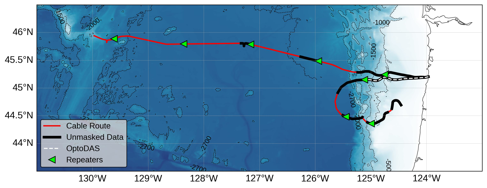

# OOI_DAS_2025
This repository provides information on how to understand the organization and access the data from the Ocean Observatories Initiative (OOI) Regional Cabled Array's Distributed Acoustic Sensing (DAS) tests conducted from November 2025-January 2026. There were two DAS systems tested during this period: Nokia's multi-span system, tested on both cables, and an OptoDAS system from Alcatel Subsea Networks, tested on the first span of the south cable. 

## Data details

In-depth documentation of the metadata, file types, and various complexities associated with the data can be found in PDF format in the documentation/ folder. 

### _Please note that the OptoDAS interrogator experienced significant calibration issues during the experiment, leading to overall poorer data quality, especially for smaller gauge lengths. See PDFs for more details._

## Data access
Both the multi-span and OptoDAS data can be accessed at the following link:

[http://piweb.ooirsn.uw.edu/das25](http://piweb.ooirsn.uw.edu/das25)

The data is organized into two separate directories, which are then sorted by year, month, date, and cable.

## Reading the data

The OptoDAS data is in hdf5 format, and follows the same configuration as that of the 2024 OOI DAS experiment. A very simple example of how to read this data can be found as a notebook in this repository. For further details on how to read and manipulate the HDF5 format data, refer to the example code in [this repository](https://github.com/uwfiberlab/OOI_DAS_2024/tree/main?tab=readme-ov-file), prepared by Qibin Shi and Ethan Williams from the University of Washington.

The Nokia multi-span data is in binary format. Examples of how to read these files can be found as a notebook in this repository.

## Cable geometry

